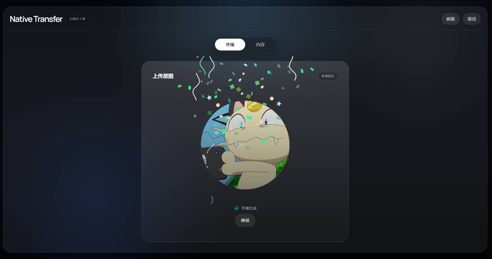
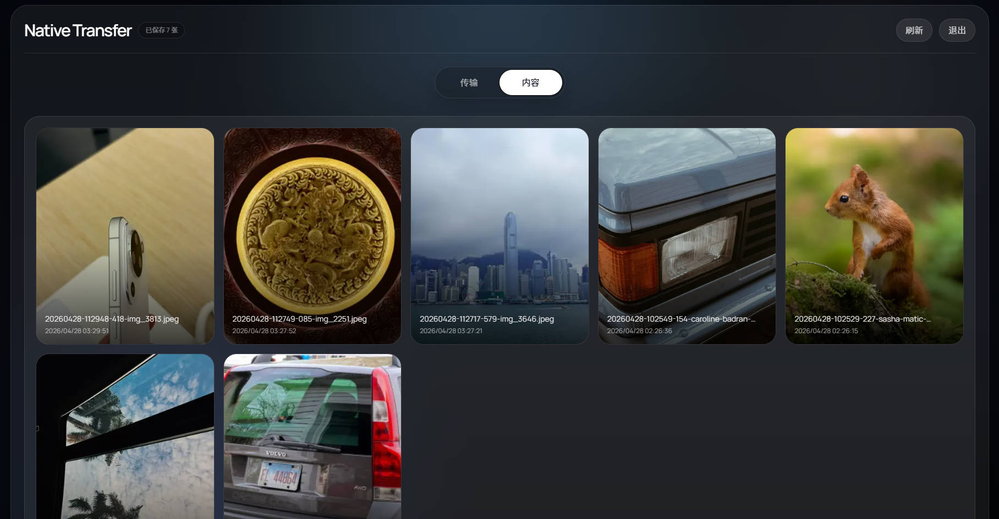

# Native Transfer

一个用于个人或小范围团队的图片传输站。

它提供一个带密码保护的 Web 界面，支持上传原图、查看历史图片、复制链接、下载原图和删除文件。图片存储基于 Vercel Blob，前端使用 Next.js App Router 构建，适合部署成一个轻量的私有传图入口。





## 功能

- 密码登录，未授权用户不能访问图片列表和原图下载
- 上传图片到 Vercel Blob
- 保留原图，不压缩、不转码
- 历史图片列表展示
- 图片大图预览
- 复制链接、下载原图、删除图片
- 适配桌面端和移动端

## 技术栈

- Next.js 16
- React 19
- Tailwind CSS 4
- Vercel Blob

## 环境变量

在项目根目录创建 `.env`：

```env
TRANSFER_PASSWORD=change-this-password
BLOB_READ_WRITE_TOKEN=vercel_blob_rw_xxx
BLOB_ACCESS=private
```

说明：

- `TRANSFER_PASSWORD`：登录页面使用的访问密码
- `BLOB_READ_WRITE_TOKEN`：Vercel Blob 读写令牌
- `BLOB_ACCESS`：可选，支持 `private` 或 `public`，默认是 `private`

推荐默认使用 `private`。当前实现里，图片列表和原图访问都要求登录态；应用内部预览图通过带 token 的接口地址加载。

## 本地开发

```bash
pnpm install
pnpm dev
```

默认启动后访问 [http://localhost:3000](http://localhost:3000)。

常用命令：

```bash
pnpm dev
pnpm build
pnpm start
pnpm lint
pnpm typecheck
```

## 部署

推荐部署到 Vercel：

1. 创建一个 Blob Store，并拿到 `BLOB_READ_WRITE_TOKEN`
2. 在项目环境变量中配置 `TRANSFER_PASSWORD`、`BLOB_READ_WRITE_TOKEN`
3. 如有需要，额外设置 `BLOB_ACCESS=private`
4. 部署项目

上传接口目前仅允许 `image/*`，单文件大小上限为 `200MB`。

## 目录结构

```text
app/
  api/
    auth/                # 登录 / 退出接口
    images/              # 图片列表、上传、读取、删除接口
  _components/           # 前端界面组件
  _lib/                  # 鉴权与存储封装
  page.tsx               # 首页入口
public/
  lotties/               # 上传/复制成功动效
```

## 行为说明

- 上传后的文件路径会带时间戳，避免重名冲突
- 历史列表按上传时间倒序显示
- 下载按钮优先打开原图下载地址
- 删除操作会直接删除 Blob 中对应文件
- 登录态通过 HTTP Only Cookie 保存

## 适用场景

- 手机向电脑快速传原图
- 临时搭一个私有图片中转站
- 个人图库素材收集入口

如果你准备把它扩展成多人共享系统，建议继续补上用户体系、操作审计、过期策略和更细粒度的访问控制。
